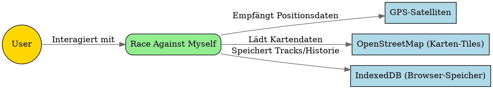
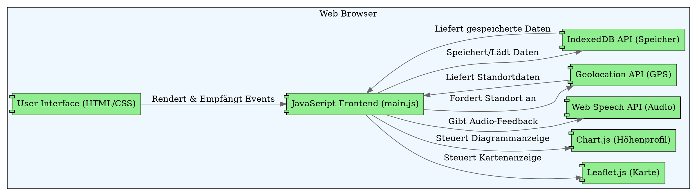
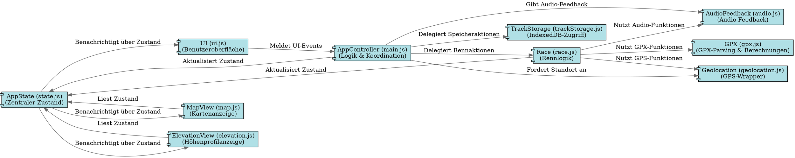

# Architektur-Dokumentation: Race Against Myself (Arch42)

Diese Dokumentation beschreibt die Architektur der "Race Against Myself"-Anwendung nach dem Arch42-Standard. Ziel ist es, die Struktur und Funktionsweise der Anwendung verständlich darzustellen, auch für Entwickler, die neu im Projekt sind.

## 1. Einleitung

Arch42 ist ein einfacher und effektiver Standard zur Dokumentation von Software-Architekturen. Er hilft uns, die wichtigsten Aspekte der Anwendung zu erfassen und zu kommunizieren.

## 2. Kontext-Diagramm

Das Kontext-Diagramm zeigt unsere Anwendung im größeren Umfeld. Es stellt dar, wer oder was mit "Race Against Myself" interagiert.

**Erklärung:**

*   **User:** Die Person, die die Anwendung nutzt.
*   **Race Against Myself:** Unsere Web-Anwendung.
*   **GPS-Satelliten:** Liefern die Standortdaten an das Gerät des Nutzers.
*   **OpenStreetMap (Karten-Tiles):** Stellt die Kartendaten für die Anzeige bereit.
*   **IndexedDB (Browser-Speicher):** Ein Datenbank-System, das direkt im Browser läuft und zum Speichern von GPX-Tracks und der Renn-Historie verwendet wird.

## 3. Container-Diagramm

Das Container-Diagramm zeigt die Hauptbausteine (Container) unserer Anwendung und wie sie miteinander kommunizieren. In einer reinen Frontend-Anwendung wie dieser sind die "Container" oft die Hauptmodule im Browser.

**Erklärung:**

*   **Web Browser:** Der Laufzeitumgebung für unsere Anwendung.
*   **User Interface (HTML/CSS):** Die sichtbaren Elemente der Anwendung.
*   **JavaScript Frontend (main.js):** Das Herzstück der Logik, das alle anderen Komponenten koordiniert.
*   **Leaflet.js (Karte):** Eine JavaScript-Bibliothek zur Anzeige von Karten.
*   **Chart.js (Höhenprofil):** Eine JavaScript-Bibliothek zur Erstellung des Höhenprofil-Diagramms.
*   **Web Speech API (Audio):** Browser-API für Sprachausgabe.
*   **Geolocation API (GPS):** Browser-API für den Zugriff auf GPS-Daten.
*   **IndexedDB API (Speicher):** Browser-API für den lokalen Datenspeicher.

## 4. Komponenten-Diagramm

Dieses Diagramm zeigt die wichtigsten JavaScript-Komponenten und ihre Beziehungen innerhalb des "JavaScript Frontend".

**Erklärung der Komponenten:**

*   **AppState (state.js):** Der zentrale Speicher für den gesamten Zustand der Anwendung (z.B. aktuelle Position, GPX-Daten, Rennstatus, UI-Nachrichten). Nutzt das Observer-Muster, um Änderungen an interessierte Komponenten zu senden.
*   **AppController (main.js):** Die Hauptlogik-Schicht. Empfängt Events von der UI, delegiert Aufgaben an andere Komponenten (Race, TrackStorage) und aktualisiert den `AppState`.
*   **UI (ui.js):** Verantwortlich für die Darstellung der Benutzeroberfläche. Empfängt den Zustand vom `AppState` und aktualisiert das DOM. Sendet Benutzerinteraktionen (Klicks, Eingaben) an den `AppController`.
*   **MapView (map.js):** Verwaltet die Kartenanzeige (Leaflet.js). Empfängt Positionsdaten vom `AppState` und aktualisiert die Marker und den Track auf der Karte.
*   **ElevationView (elevation.js):** Verwaltet die Höhenprofilanzeige (Chart.js). Empfängt Daten vom `AppState` und aktualisiert das Diagramm.
*   **Race (race.js):** Enthält die Kernlogik des Rennens: GPX-Parsing, Distanzberechnungen, Ghost-Logik, Geschwindigkeitsmessung und Rennstatus-Updates. Aktualisiert den `AppState` mit den Rennergebnissen.
*   **GPX (gpx.js):** Hilfsklasse für das Parsen von GPX-Dateien und geografische Berechnungen (Distanz, Länge).
*   **Geolocation (geolocation.js):** Wrapper für die Browser Geolocation API.
*   **AudioFeedback (audio.js):** Wrapper für die Web Speech API zur Sprachausgabe.
*   **TrackStorage (trackStorage.js):** Verwaltet das Speichern und Laden von GPX-Tracks in der IndexedDB.

## 5. Bausteine

Die Anwendung ist in JavaScript-Module organisiert, die jeweils eine spezifische Aufgabe erfüllen.

*   **`js/state.js`**: Definiert die `AppState`-Klasse, die den zentralen Zustand der Anwendung verwaltet und ein einfaches Observer-Muster implementiert.
*   **`js/main.js`**: Enthält den `AppController`, der die Hauptlogik und Koordination zwischen den Komponenten übernimmt. Hier werden alle anderen Module initialisiert und miteinander verbunden.
*   **`js/ui.js`**: Kümmert sich um die Interaktion mit dem DOM (Document Object Model). Es liest den Zustand und aktualisiert die Benutzeroberfläche. Es empfängt auch Benutzereingaben und leitet sie an den `AppController` weiter.
*   **`js/race.js`**: Beinhaltet die gesamte Rennlogik, von der Verarbeitung der GPS-Daten bis zur Berechnung der Zeitdifferenz zum Ghost.
*   **`js/gpx.js`**: Eine Utility-Klasse für alles, was mit GPX-Daten zu tun hat: Parsen, Distanzberechnungen, Generierung von GPX-Dateien.
*   **`js/map.js`**: Kapselt die Logik für die Kartenanzeige unter Verwendung der Leaflet.js-Bibliothek.
*   **`js/elevation.js`**: Kapselt die Logik für die Höhenprofilanzeige unter Verwendung der Chart.js-Bibliothek.
*   **`js/geolocation.js`**: Ein einfacher Wrapper um die native Geolocation API des Browsers.
*   **`js/audio.js`**: Ein einfacher Wrapper um die Web Speech API für Audio-Feedback.
*   **`js/trackStorage.js`**: Verwaltet die Persistenz von GPX-Tracks und Renn-Historie in der IndexedDB des Browsers.

## 6. Qualitätsanforderungen

Folgende Qualitätsanforderungen sind für die Anwendung wichtig:

*   **Performance:** Die Anwendung muss flüssig laufen, auch bei längeren Tracks und häufigen Positionsupdates. (Wird durch effiziente Updates und State-Management unterstützt).
*   **Wartbarkeit:** Der Code ist modular aufgebaut und folgt dem Prinzip der Trennung der Belange (Separation of Concerns), um zukünftige Änderungen und Erweiterungen zu erleichtern.
*   **Benutzerfreundlichkeit:** Die Benutzeroberfläche ist intuitiv und bietet klares Feedback zum Rennverlauf.
*   **Zuverlässigkeit:** Die Anwendung muss auch unter schwierigen Bedingungen (z.B. GPS-Signalverlust) stabil bleiben und Fehler elegant behandeln.
*   **Offline-Fähigkeit:** Da die Anwendung im Browser läuft und Daten lokal speichert, ist sie weitgehend offline nutzbar (nach dem ersten Laden).

## 7. Entscheidungen

*   **Zentrales State-Management:** Wir haben uns für ein einfaches, selbstgebautes State-Management-System entschieden, um den Datenfluss klar und nachvollziehbar zu gestalten. Dies vermeidet komplexe Abhängigkeiten und macht die Anwendung leichter testbar.
*   **Vanilla JavaScript:** Die Anwendung nutzt hauptsächlich Vanilla JavaScript ohne große Frameworks. Dies reduziert die Komplexität und die Dateigröße, erfordert aber mehr manuelle DOM-Manipulation.
*   **Leaflet.js für Karten:** Eine leichtgewichtige und flexible Bibliothek für interaktive Karten.
*   **Chart.js für Diagramme:** Eine vielseitige Bibliothek zur Erstellung von Diagrammen.
*   **IndexedDB für Persistenz:** Bietet eine robuste Möglichkeit, größere Datenmengen (GPX-Tracks) direkt im Browser zu speichern.
*   **Kein Backend:** Die Anwendung ist vollständig clientseitig, was die Bereitstellung vereinfacht und die Abhängigkeit von Servern eliminiert.
